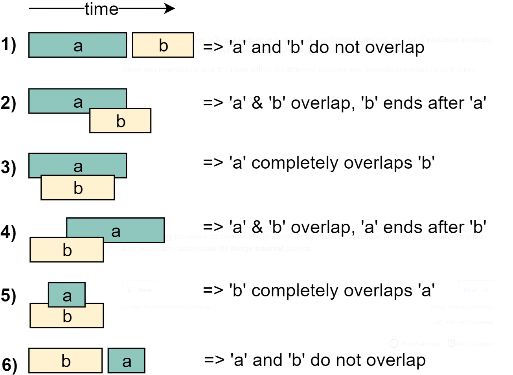

# Coding Interview Patterns
- Reference: Educative.io Grokking the Coding Interview

## Sliding Window
- Try to reuse work that we have already done.
- The sliding window keeps track of the common elements from each pass 
    - Only add the new element and subtract the element no longer needed.
- Turns O(k*n) -> O(n)

``` CSharp
// While Loop
public static int UsingAWhileLoop(List<int> inputList)
{

    // Figure out the size of the window needs to be. 
    // Is it variable? How is it going to vary? 
    int windowSize = 5; 

    // These are the iterators for the window
    int windowEnd = 0; 
    int windowStart = 0;

    // This is 1 way of using a window.
    List<int> window = new List<int>();

    while(windowEnd < inputList.Count)
    {
        // Do something with the element at "windowEnd"
        something = inputList[windowEnd]


        // Figure out how to keep the window at the appropriate size. 
        if(window.Count > windowSize)
        {
            // Do something with the beginning of the window.
            something -= inputList[windowStart];

            // Remove the first item from the window list.
            window.RemoveAt(inputList[windowStart])
            
            // Move the windowStart pointer.
            windowStart++;
        }

        // Iterate the windowEnd
        windowEnd++;
    }
}

// For Loop
public static int UsingAForLoop(List<int> inputList)
{
    int windowSize = 5;
    int windowStart = 0;
    List<int> window = new List<int>();

    for(int windowEnd = 0; windowEnd < inputList.Count; windowEnd++)
    {
        window.Add(inputList[windowEnd]);

        // Do something with the element at "windowEnd"
        something = inputList[windowEnd];

        if(window.Count > windowSize)
        {
            // Do something with the beginning of the window.
            something -= inputList[windowStart];

            // Remove the first item from the window list.
            window.RemoveAt(inputList[windowStart])

            // Move the windowStart pointer.
            windowStart++;
        }
    }
}

```

## Two Pointer
- Use the Two Pointer Pattern when dealing with a sorted array or linked list and need to find a set of elements that fulfill defined constraints.
    - The set of elements could be pairs, a triplet or a subarray.

``` CSharp
public static List<int> FindAPairsSumThatMatchesTarget(List<int> inputList, int target)
            {
                // These are the 2 pointers.
                int leftIndex = 0, rightIndex = inputList.Count - 1;

                // We don't know how long this is going to run so we use a while loop
                while (leftIndex < rightIndex)
                {
                    // This is the thing we are trying to do.
                    int sum = inputList[leftIndex] + inputList[rightIndex];

                    // If we accomplish the goal then we can build what we need and return it.
                    if (sum == target)
                    {
                        List<int> outputList = new List<int>()
                        {
                            leftIndex,
                            rightIndex
                        };

                        return outputList;
                    }

                    // ============ Moving the Pointers ====================

                    // If the product of our algorithm is bigger than the goal then move the right pointer left.
                    if(sum > target)
                    {
                        rightIndex--;
                    }

                    // If the product of our algorithm is smaller than the goal then move the left pointer right.
                    if(sum < target)
                    {
                        leftIndex++;
                    }
                }

                return null;
            }
```
## Fast & Slow (Hare & Tortoise)
``` CSharp
public static void MethodName(Node head)
{
    Node fast = head;
    Node slow = head;

    while(fast != null && fast.Next != null)
    {
        fast = fast.Next.Next;
        slow = slow.Next;
    }
}
```

## Merge Intervals


## Cyclic Sort
## In-place Reversal of a Linked List
## Tree Breath First Search
## Tree Depth First Search
## Two Heaps
## Subset
## Modified Binary Search
## Bitwise XOR
## Top 'K' Elements
## K-Way Merge
## 0/1 Knapsack
## Topograical Sort
## 