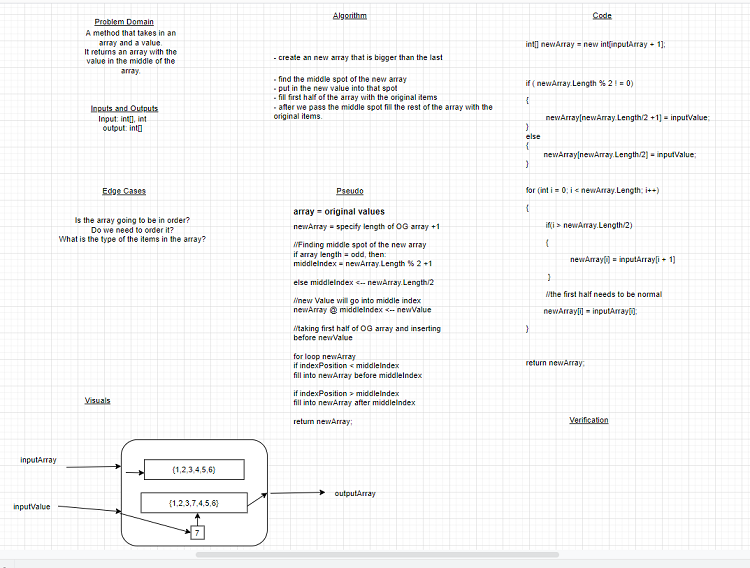

## Array Shift
*Author: Trevor Stubbs*

---

### Problem Domain
Write a method called `InsertShiftArray` which takes in an array and the value to be added. 
Without utilizing any of the built-in methods available to your language, return an array with 
the new value added at the middle index.

---

### Inputs and Expected Outputs

| Input | Expected Output |
| :----------- | :----------- |
| [2,4,6,8], 5 | [2,4,5,6,8] |
| [4,8,15,23,42], 16 | [4,8,15,16,23,42] |

---

### Big O

| Time | Space |
| :----------- | :----------- |
| O(n) | O(n + 1) |

---

### Whiteboard Visual

- [Whiteboard](https://drive.google.com/file/d/1Ot9iCIbAn-8C6zUokZikqziJ96da5Oht/view?usp=sharing)

---

### Github Link
- [GitHub](https://github.com/TrevorStubbs/data-structures-and-algorithms/blob/master/Dotnet/code-challenges/ArrayShift/ArrayShift/Program.cs)

---

### Change Log
- 1.0 Inital setup
- 1.1 Tests built
- 1.2 Method Works
- 1.3 Refactor and Comments

---

For more information on Markdown: https://www.markdownguide.org/cheat-sheet