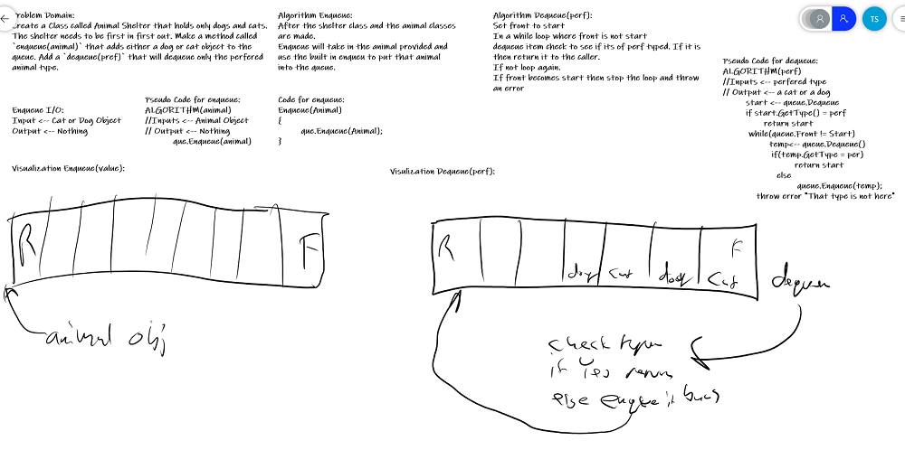

## FIFO Animal Shelter
*Author: Trevor Stubbs*

---

### Problem Domain
- Create a class called AnimalShelter which holds only dogs and cats. The shelter operates using a first-in, first-out approach.
- Implement the following methods:
    - `enqueue(animal)`: adds animal to the shelter. animal can be either a dog or a cat object.
    - `dequeue(pref)`: returns either a dog or a cat. If pref is not "dog" or "cat" then return null.

---

### Inputs and Expected Outputs (Enqueue(animal)

| Input1 | Arguments | Internal State |
| :----------- | :----------- | :----------- |

### Inputs and Expected Outputs (Dequeue(perf))

| Input | Output| Internal State
--- | --- | ---

---

### Big O (Enqueue(animal)

| Time | Space |
| :----------- | :----------- |
| O(1) | O(1) |

### Big O (Enqueue(animal)

| Time | Space |
| :----------- | :----------- |
| O(n) | O(n) |

---

### Whiteboard Visual

---

### Change Log
- 1.0: Repo Setup 

---

For more information on Markdown: https://www.markdownguide.org/cheat-sheet