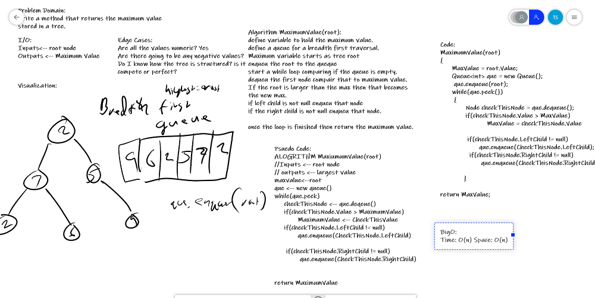

## Find Maximum Value
*Author: Trevor Stubbs*

---

### Problem Domain
Write an instance method called find-maximum-value. 
Without utilizing any of the built-in methods available to your language, 
return the maximum value stored in the tree. You can assume that the values 
stored in the Binary Tree will be numeric.

---

### Inputs and Expected Outputs

| Internal State | Expected Output |
| :----------- | :----------- | :----------- |
| [2, 7, 2, 6, 5, 11, 5, 9, 4] |  [11]

---

### Big O

| Time | Space |
| :----------- | :----------- |
| O(n) | O(1) |

---

### Whiteboard Visual

---

### Change Log
- 1.0 Repo Setup 

---

For more information on Markdown: https://www.markdownguide.org/cheat-sheet