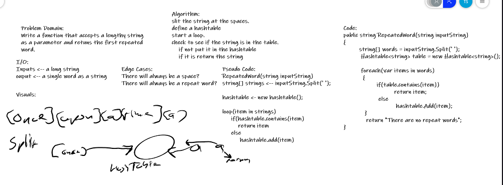

## Array Shift
*Author: Trevor Stubbs*
---

### Problem Domain
Write a method called `repeatedWord` a large string and returns the first wod to occur more than once in the provided string.

---

### Inputs and Expected Outputs

| Input | Expected Output |
| :----------- | :----------- |
| "Once upon a time, there was a brave princess who..." | "a" |

---

### Big O

| Time | Space |
| :----------- | :----------- |
| O(n) | O(n) |

---

### Whiteboard Visual

---

### Github Link
- [GitHub](https://github.com/TrevorStubbs/data-structures-and-algorithms/blob/master/Dotnet/code-challenges/ArrayShift/ArrayShift/Program.cs)

---

### Change Log
- 1.0 Inital setup
- 1.1 Tests built
- 1.2 Method Works
- 1.3 Refactor and Comments

---

For more information on Markdown: https://www.markdownguide.org/cheat-sheet