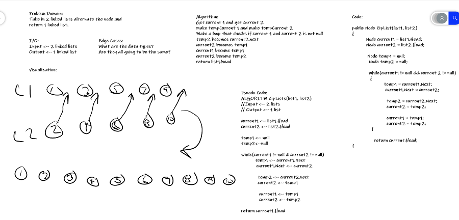

## Linked List Zip
*Author: Trevor Stubbs*

---

### Problem Domain
Write a method that takes 2 linked lists and zip them together. 
The 2 lists will become 1 where the nodes of each list is alternating in the new list.

---

### Inputs and Expected Outputs

| Input1 | Input2 | Expected Output |
| :----------- | :----------- | :----------- |
| [1,3,2] | [5,9,4] | [1,5,3,9,2,4]
| [1,3] | [5,9,4] | [1,5,3,9,4]

---

### Big O

| Time | Space |
| :----------- | :----------- |
| O(n) | O(1) |

---

### Whiteboard Visual

---

### Change Log
- 1.3 Comments and README
- 1.2 Challenge complete
- 1.1 Challenge outline
- 1.0 Repo Setup 

---

For more information on Markdown: https://www.markdownguide.org/cheat-sheet