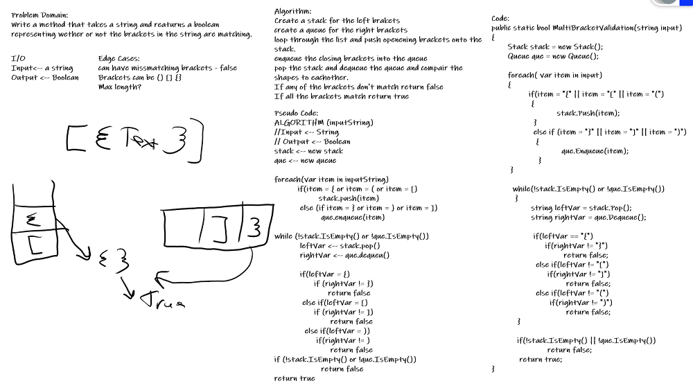

## Multi Bracket Validation
*Author: Trevor Stubbs*

---

### Problem Domain
Your function should take a string as its only argument, and should return a boolean representing whether or not the brackets in the string are balanced. There are 3 types of brackets:

- Round Brackets : ()
- Square Brackets : []
- Curly Brackets : {}

---

### Inputs and Expected Outputs

| Input1 | Expected Output |
| :----------- | :----------- |
| {}	| TRUE
| {}(){} |	TRUE
| ()[[Extra Characters]] |	TRUE
| (){}[[]] |	TRUE
| {}{}(()) |	TRUE
| [({}] |	FALSE
| (](	| FALSE
| {(})	| FALSE

---

### Big O

| Time | Space |
| :----------- | :----------- |
| O(n) | O(n) |

---

### Whiteboard Visual

---

### Change Log
- 1.3: README and Summary Comments
- 1.2: Tests ran
- 1.1: Method Made
- 1.0: Repo Setup 

---

For more information on Markdown: https://www.markdownguide.org/cheat-sheet