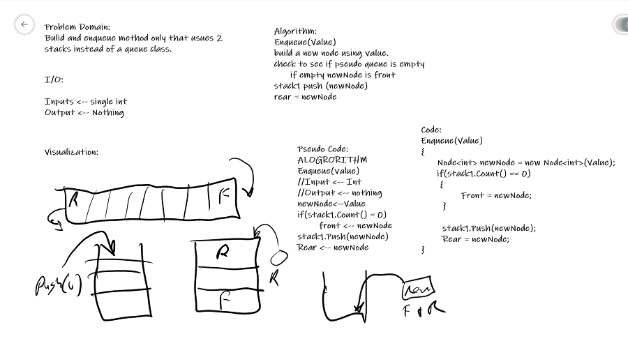

## Queues With Stacks
*Author: Trevor Stubbs*

---

### Problem Domain
Write a `PseudoQueue` class that uses 2 stacks to implement a standard queue interface. 
Have `Enqueue(value)` and `Dequeue()` methods like a normal queue but implement them with stacks.

---

### Inputs and Expected Outputs (Enqueue)

| Input1 | Arguments | Expected Output |
| :----------- | :----------- | :----------- |
| [10]->[15]->[20] | 5 | [5]->[10]->[15]->[20]
| [] | 5 | [5]

### Inputs and Expected Outputs (Dequeue)

| Input | Output| Internal State
--- | --- | ---
[5]->[10]->[15]->[20] |	20 |	[5]->[10]->[15])
[5]->[10]->[15] | 15 | [5]->[10]

---

### Big O (Enqueue)

| Time | Space |
| :----------- | :----------- |
| O(1) | O(1) |

### Big O (Dequeue)

| Time | Space |
| :----------- | :----------- |
| O(n) | O(n) |

---

### Whiteboard Visual

---

### Change Log
- 1.3: Testing Complete
- 1.2: Dequeue() Complete
- 1.1: Enqueu() Complete
- 1.0: Repo Setup 

---

For more information on Markdown: https://www.markdownguide.org/cheat-sheet