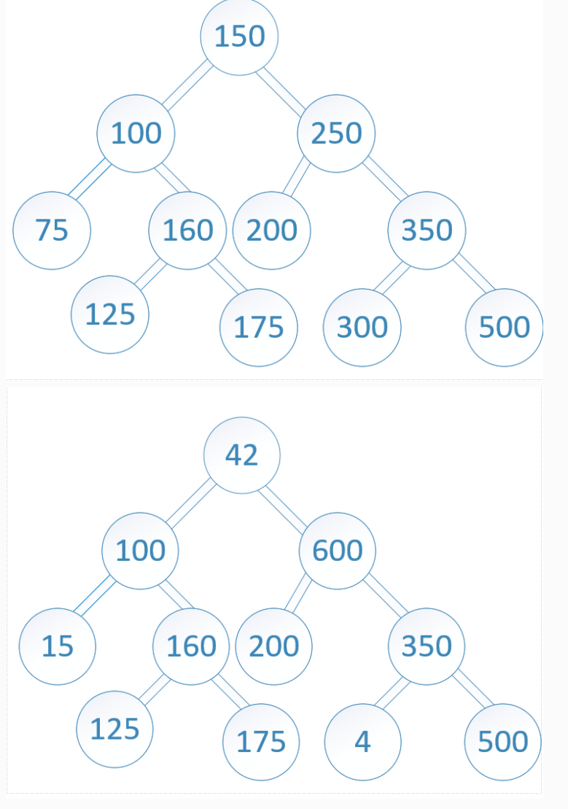
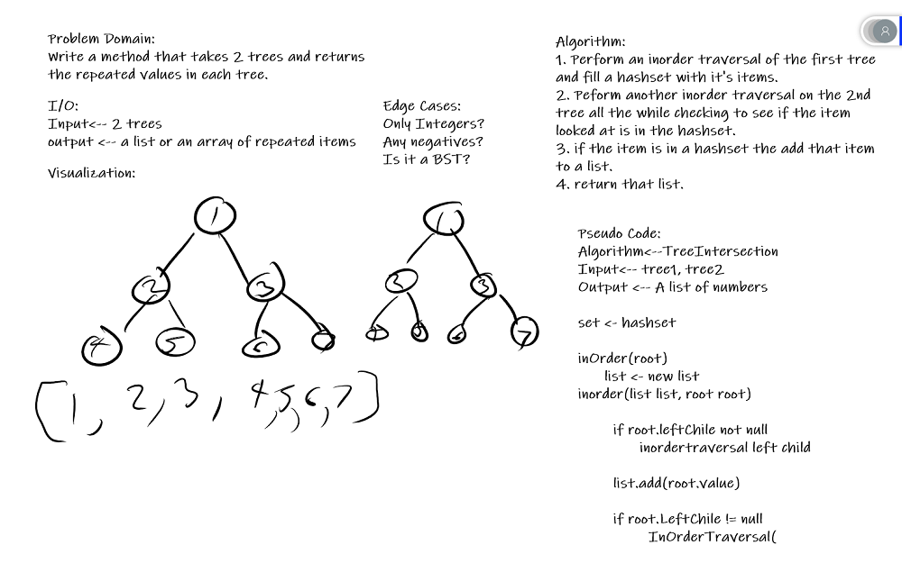

## Array Shift
*Author: Trevor Stubbs*
---

### Problem Domain
Write a method called `TreeIntersection` that takes 2 trees as inputs and outputs the items that are in each tree.

---

### Inputs and Expected Outputs

| Input | Expected Output |
| :----------- | :----------- |
|  | [100,160,125,175,200,350,500] |

---

### Big O

| Time | Space |
| :----------- | :----------- |
| O(n) | O(n) |

---

### Whiteboard Visual

---

### Change Log
- 1.0 Inital setup
- 1.1 Tests built
- 1.2 Method Works
- 1.3 Refactor and Comments

---

For more information on Markdown: https://www.markdownguide.org/cheat-sheet