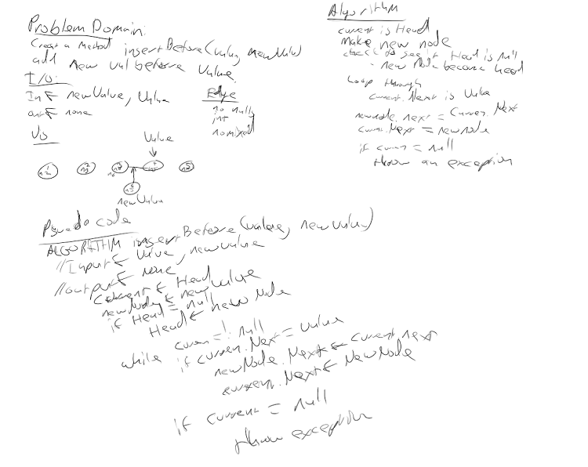

# Singly Linked List
This Data Structure demonstrates how a linked list is constructed, iterated through and show all the values in the list. 

## Challenge
1. Can successfully instantiate an empty linked list
1. Can properly insert into the linked list
1. The head property will properly point to the first node in the linked list
1. Can properly insert multiple nodes into the linked list
1. Will return true when finding a value within the linked list that exists
1. Will return false when searching for a value in the linked list that does not exist
1. Can properly return a collection of all the values that exist in the linked list

## Approach & Efficiency
- LinkedList.Insert() - Time O(1), Space O(1).
- LinkedList.Includes() - Time O(n), Space O(1).
- LinkedList.ToString() - Time O(n), Space O(n).

## API
- LinkedList.Insert()
- LinkedList.Includes() 
- LinkedList.ToString() 

---

## Challenge 06
1. Can successfully add a node to the end of the linked list
1. Can successfully add multiple nodes to the end of a linked list
1. Can successfully insert a node before a node located i the middle of a linked list
1. Can successfully insert a node before the first node of a linked list
1. Can successfully insert after a node in the middle of the linked list
1. Can successfully insert a node after the last node of the linked list

## Approach & Efficiency
- LinkedList.Append() - Time O(n), Space O(1).
- LinkedList.InsertBefore() - Time O(n), Space O(1).
- LinkedList.InsertAfter() - Time O(n), Space O(1).

## API
- LinkedList.Append()
- LinkedList.InsertBefore()
- LinkedList.InsertAfter()

## Whiteboard

---

