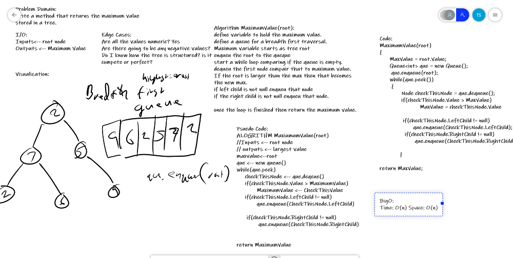

# Trees and BinarySearchTrees
This Data Structure demonstrates how a tree is constructed. Also how to move through a tree in PreOrder, InOrder and PostOrder fashions. 

## Initial Implementation Tests
1. Can successfully instantiate an empty tree
1. Can successfully instantiate a tree with a single root node
1. Can successfully add a left child and right child to a single root node
1. Can successfully return a collection from a preorder traversal
1. Can successfully return a collection from an inorder traversal
1. Can successfully return a collection from a postorder traversal

## Approach & Efficiency
- Tree.PreOrder(root) - Time: O(n) | Space: O(1)
- Tree.InOrder(root) - Time: O(n) | Space: O(1)
- Tree.PostOrder(root) - Time: O(n) | Space: O(1)
- Tree.FindMaximumValue() - Time: O(n) | Space: O(n)
- BinarySearchTree.Add(value) - Time: O(n) | Space: O(1)
- BinarySearchTree.Contains(value) - Time: O(logn) | Space: O(1)

## API
- Tree.PreOrder()
- Tree.InOrder()
- Tree.PostOrder()
- Tree.FindMaximumValue() *Integer only*
- BinarySearchTree.Add()
- BinarySearchTree.Contains() 

---

## Find Maximum Value

---

### Problem Domain
Write an method called FindMaximumValue. 
Without utilizing any of the built-in methods available to your language, 
return the maximum value stored in the tree. You can assume that the values 
stored in the Binary Tree will be numeric.

---

### Inputs and Expected Outputs

| Internal State | Expected Output |
| :----------- | :----------- | :----------- |
| [2, 7, 2, 6, 5, 11, 5, 9, 4] |  [11]

---

### Big O

| Time | Space |
| :----------- | :----------- |
| O(n) | O(n) |

---

### Whiteboard Visual

