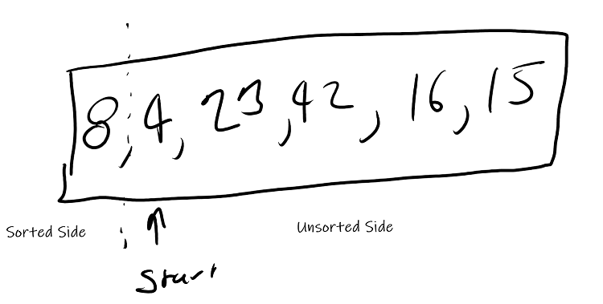
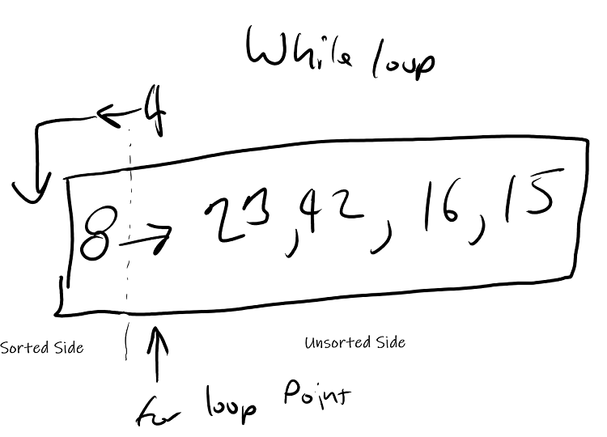
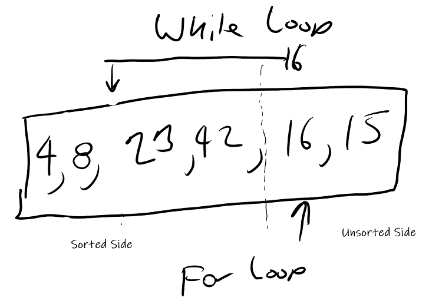
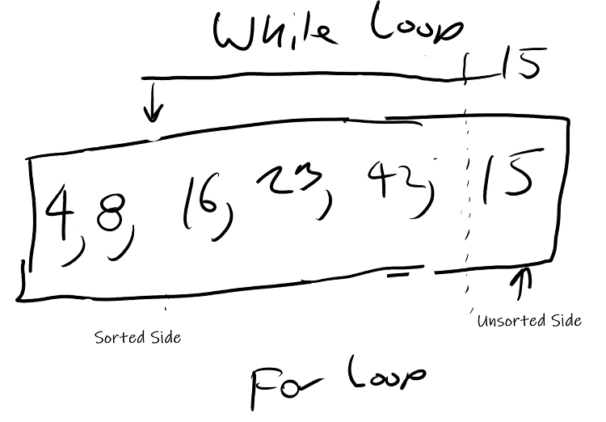
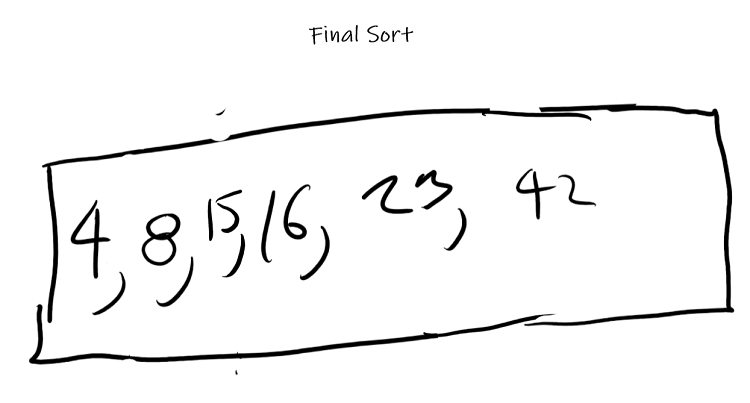

# Insertion Sort

## Overview
- Insertion Sort is the act of sorting a list of items by picking 1 item and moving it left until its sorted between a higher and a lower item. 
- It takes 2 loops to peform an insertion sort which leaves it at an O(n<sup>2</sup>) time complexity.
- It can be peformed in place which leaves it at a O(1) space complexity.

## How it works.

- An insertion sort is made up of 2 loops
    - A `for` loop to keep track of the sorted and unsorted side of the collection
    - A `while` loop to sort the current item.

## PseudoCode
```
  InsertionSort(int[] arr)
  
    FOR i = 1 to arr.length
    
      int j <-- i - 1
      int temp <-- arr[i]
      
      WHILE j >= 0 AND temp < arr[j]
        arr[j + 1] <-- arr[j]
        j <-- j - 1
        
      arr[j + 1] <-- temp
```
<sub>Code Fellows</sub>

## Visualization










## CSharp Code
``` CSharp
static int[] InsertionSort(int[] arr)
{
    for (int i = 1; i < arr.Length; i++)
    {
        int j = i - 1;
        int temp = arr[i];

        while (j >= 0 && temp < arr[j])
        {
            arr[j + 1] = arr[j];
            j = j - 1;
        }

        arr[j + 1] = temp;
    }

    return arr;
}
```

## Detailed Explanation
- Start a for loop that will run the length of the provided array.
  - `i` keeps track of the sorted and unsorted side
  - inside the for loops
    - define `j` which is 1 less than `i`
    - define temp which holds the value of arr at position `i`.
    - Start a while loop that checks to see if temp is less than arr at position `i` and check if `j` is greater than or equal to 0.
      - make arr at position i + 1 equal to arr at position `j`
      - make `j` equal to `j` - 1
    - outside of the while loop but still inside the for loop make arr at `j` + 1 equal to temp
  - once outside the for loop return the arr back to the caller.