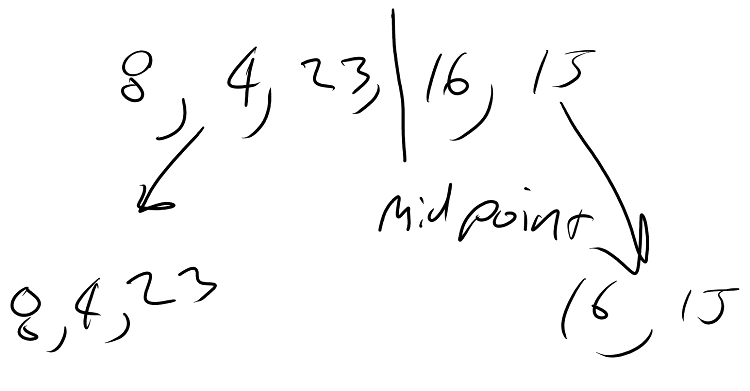
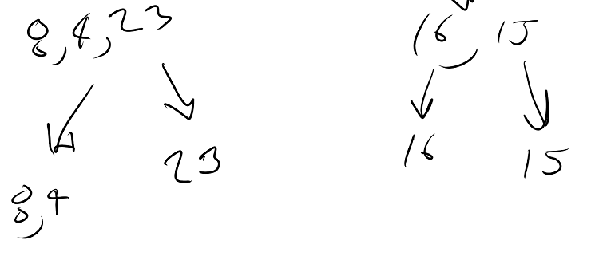
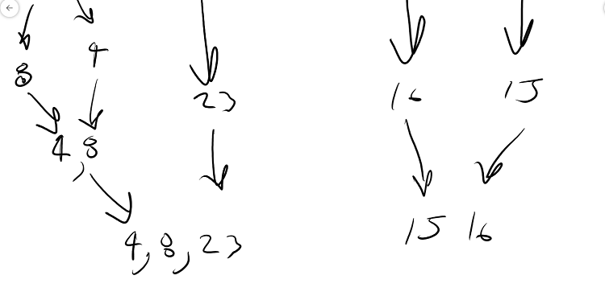
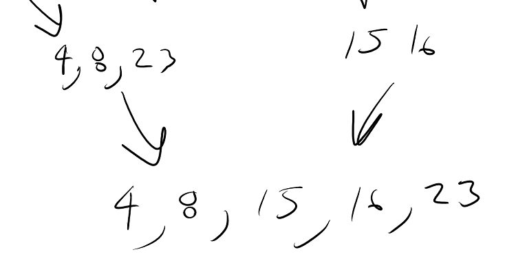

# Merge Sort

## Overview
- Merge Sort is the act of sorting a list of items by breaking the collection into the it's smallest pieces and then merging it back together all the while sorting as it's being reassembled. 
- It takes 2 loops to perform an insertion sort which leaves it at an O(n<sub>log n</sub>) time complexity.
- It can be performed in place which leaves it at a O(n) space complexity.

## How it works.

- First we start recursively splitting the collection in half until it can no longer be split.
- Then we stitch the collection back together all the while sorting all the way back up. 

## PseudoCode
```
ALGORITHM Mergesort(arr)
    DECLARE n <-- arr.length
           
    if n > 1
      DECLARE mid <-- n/2
      DECLARE left <-- arr[0...mid]
      DECLARE right <-- arr[mid...n]
      // sort the left side
      Mergesort(left)
      // sort the right side
      Mergesort(right)
      // merge the sorted left and right sides together
      Merge(left, right, arr)

ALGORITHM Merge(left, right, arr)
    DECLARE i <-- 0
    DECLARE j <-- 0
    DECLARE k <-- 0

    while i < left.length && j < right.length
        if left[i] <= right[j]
            arr[k] <-- left[i]
            i <-- i + 1
        else
            arr[k] <-- right[j]
            j <-- j + 1
            
        k <-- k + 1

    if i = left.length
       set remaining entries in arr to remaining values in right
    else
       set remaining entries in arr to remaining values in left

```
<sub>Code Fellows</sub>

## Visualization









## CSharp Code
``` CSharp
static int[] MergeSortMethod(int[] arr)
        {
            int n = arr.Length;

            if (n > 1)
            {
                int mid = n / 2;
                int[] left = new int[mid];
                int[] right;

                if(arr.Length % 2 == 0)
                {
                    right = new int[mid];
                }
                else
                {
                    right = new int[mid + 1];
                }

                for (int i = 0; i < mid; i++)
                {
                    left[i] = arr[i];
                }

                int x = 0;
                for (int i = mid; i < arr.Length; i++)
                {
                    right[x] = arr[i];
                    x++;
                }

                MergeSortMethod(left);

                MergeSortMethod(right);

                MergeSortMethod(left, right, arr);
            }

            return arr;
        }

        static void MergeSortMethod(int[] left, int[] right, int[] arr)
        {
            int i = 0;
            int j = 0;
            int k = 0;

            while(i < left.Length && j < right.Length)
            {
                if(left[i] <= right[j])
                {
                    arr[k] = left[i];
                    i++;
                }
                else
                {
                    arr[k] = right[j];
                    j++;
                }

                k++;
            }

            if (i == left.Length)
            {
                while (j < right.Length)
                {
                    arr[k] = right[j];
                    j++;
                    k++;
                }
            }
            else
            {
                while (i < left.Length)
                {
                    arr[k] = left[i];
                    i++;
                    k++;
                }
            }
        }
    }
```

## Detailed Explanation
- Start by splitting the list in half.
  - then recursively call MergeSort again which splits that half into another half.
  - Do that for both sides till there are no way of splitting the list any longer.
- Then each broken up part of the list gets sent through the MergeSort method that has the 3 parameter Overload. 
    - In this method we stitch each portion together by
      - placing the items portion left of the bigger items.
    - as each method pops off the call stack it the new sorted array gets sent through the 3 parameter merge sort again until the call stack is completely empty.

    