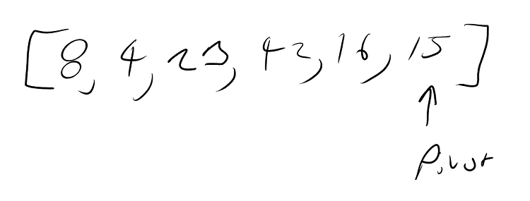
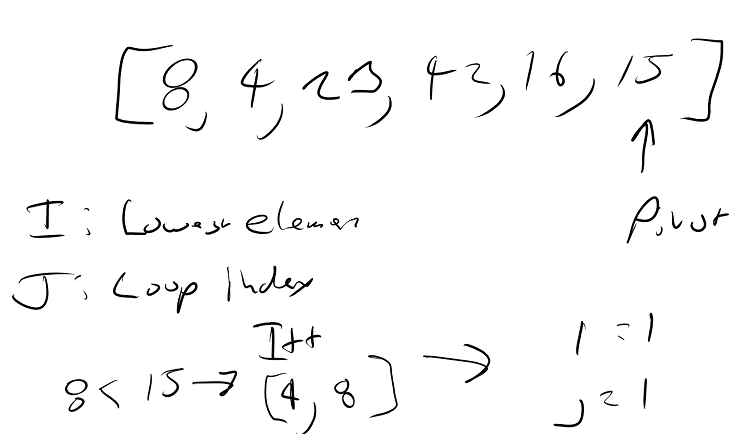
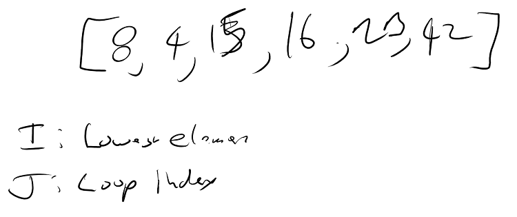

# Insertion Sort

## Overview
- Quick Sort is the act of sorting a list of items by picking 1 item as a pivot and comparing it to the rest of the items. Each time an item is less than the pivot we swap locations with a known larger item. 
    - we keep doing this recursively until all items are in their correct spot.


## How it works.

- Quick sort requires recursion and a helper method.
  - Recursion to keep moving the pivot
  - The helper method to sort the pivot into its correct spot

## PseudoCode
```
ALGORITHM QuickSort(arr, left, right)
    if left < right
        // Partition the array by setting the position of the pivot value 
        DEFINE position <-- Partition(arr, left, right)
        // Sort the left
        QuickSort(arr, left, position - 1)
        // Sort the right
        QuickSort(arr, position + 1, right)

ALGORITHM Partition(arr, left, right)
    // set a pivot value as a point of reference
    DEFINE pivot <-- arr[right]
    // create a variable to track the largest index of numbers lower than the defined pivot
    DEFINE low <-- left - 1
    for i <- left to right do
        if arr[i] <= pivot
            low++
            Swap(arr, i, low)

     // place the value of the pivot location in the middle.
     // all numbers smaller than the pivot are on the left, larger on the right. 
     Swap(arr, right, low + 1)
    // return the pivot index point
     return low + 1

ALGORITHM Swap(arr, i, low)
    DEFINE temp;
    temp <-- arr[i]
    arr[i] <-- arr[low]
    arr[low] <-- temp
```
<sub>Code Fellows</sub>


## Visualization






## CSharp Code
``` CSharp
public static int[] QuickSortMethod(int[] arr, int left, int right)
    {
        if (left < right)
        {
            int position = Partition(arr, left, right);

            QuickSortMethod(arr, left, position - 1);

            QuickSortMethod(arr, position + 1, right);
        }

        return arr;
    }

    public static int Partition(int[] arr, int left, int right)
    {
        int pivot = arr[right];

        int low = left - 1;

        for (int i = left; i < right; i++)
        {
            if (arr[i] < pivot)
            {
                low++;

                int temp1 = arr[low];
                arr[low] = arr[i];
                arr[i] = temp1;
            }
        }

        int temp2 = arr[low + 1];
        arr[low + 1] = arr[right];
        arr[right] = temp2;

        return low + 1;
    }
```

## Detailed Explanation
- Start by seeing if the left most item is smaller than the right most item.
    - If it is then start by running the first partition method
- The Partition method takes 3 parameters
    - The array, the left most position, and the right most position.
- In the Partition Method
    - Define the right most position as the pivot 
    - Define the left most position - 1 as the lowest point
    - Start a for loop that starts at the lowest position and runs till the highest position.
        - Check to see if the array at the current loop position is less than the pivot
            - If it is
                - increment low
                - swap array at position low with current loop position.
            - Keep doing this till the loop ends.
        - Swap the Pivot with the item that is at it's correct position.
- All these steps get called recursively until all items are in their correct position.