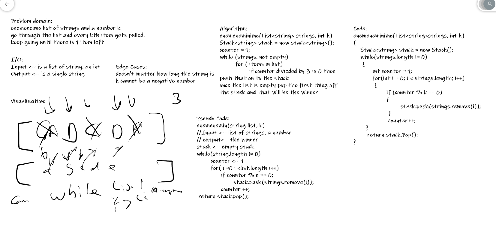

## Eeny meeny miny moe

- Author: Trevor Stubbs

---

### Problem Domain
People are standing in a circle playing Eeney Meeney Miney Moe. 
Counting begins at a specified point in the circle and proceeds around the 
circle in a specified direction. After a specified number of people are 
skipped, the next person is removed. The procedure is repeated with the 
remaining people, starting with the next person, going in the same direction 
and skipping the same number of people, until only one person remains, and 
wins the game.

Write a function called EeneyMeeneyMineyMoe() that accepts a list of strings 
and an int k. Start at the beginning of the list and count up to k and remove 
the person at that index from the list. Keep counting from that index and 
count up to k over and over until only one person is left in the list. 
Return a string with the name of the last person left in the list.

---

### Inputs and Expected Outputs

| Input | Expected Output |
| :----------- | :----------- |
| [A, B, C, D, E] | D |

---

### Big O

| Time | Space |
| :----------- | :----------- |
| O(n) | O(1) |

---

### Whiteboard Visual

---

For more information on Markdown: https://www.markdownguide.org/cheat-sheet