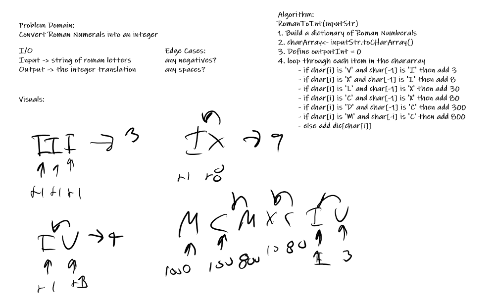

## Roman Numeral to Integer

- Author: Trevor Stubbs

---

### Problem Domain
Translate a Roman Numeral string into an integer

---

### Inputs and Expected Outputs TODO

| input | output|
| --- | --- |
| "III" | 3 |
| "IV" | 4 |
| "IX" | 9 |
| "LVIII" | 58 |

---

### Big O

| Time | Space |
| :----------- | :----------- |
| O(n) | O(n) |

---

### Whiteboard Visual TODO
 

---

For more information on Markdown: https://www.markdownguide.org/cheat-sheet